# Sequence Diagram (Mermaid Live Editor) — Gallery Puan

Copy paste kode di bawah ke https://mermaid.live untuk melihat diagram.

---

## 1. Pencarian Produk

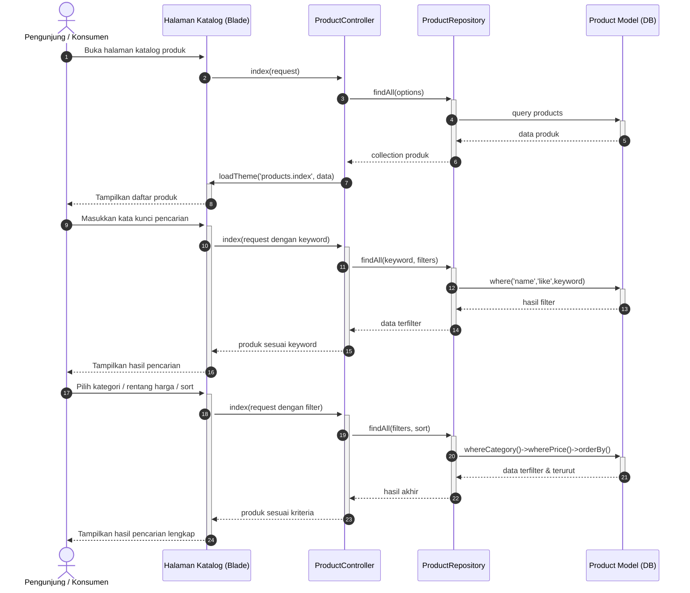
```mermaid
sequenceDiagram
    autonumber
    
    actor User as Pengunjung / Konsumen
    participant View as Halaman Katalog (Blade)
    participant Ctrl as ProductController
    participant Repo as ProductRepository
    participant Model as Product Model (DB)

    User->>+View: Buka halaman katalog produk
    View->>+Ctrl: index(request)
    Ctrl->>+Repo: findAll(options)
    Repo->>+Model: query products
    Model-->>-Repo: data produk
    Repo-->>-Ctrl: collection produk
    Ctrl->>+View: loadTheme('products.index', data)
    View-->>-User: Tampilkan daftar produk

    User->>+View: Masukkan kata kunci pencarian
    View->>+Ctrl: index(request dengan keyword)
    Ctrl->>+Repo: findAll(keyword, filters)
    Repo->>+Model: where('name','like',keyword)
    Model-->>-Repo: hasil filter
    Repo-->>-Ctrl: data terfilter
    Ctrl-->>-View: produk sesuai keyword
    View-->>-User: Tampilkan hasil pencarian

    User->>+View: Pilih kategori / rentang harga / sort
    View->>+Ctrl: index(request dengan filter)
    Ctrl->>+Repo: findAll(filters, sort)
    Repo->>+Model: whereCategory()->wherePrice()->orderBy()
    Model-->>-Repo: data terfilter & terurut
    Repo-->>-Ctrl: hasil akhir
    Ctrl-->>-View: produk sesuai kriteria
    View-->>-User: Tampilkan hasil pencarian lengkap
```

---

## 2. Detail Produk

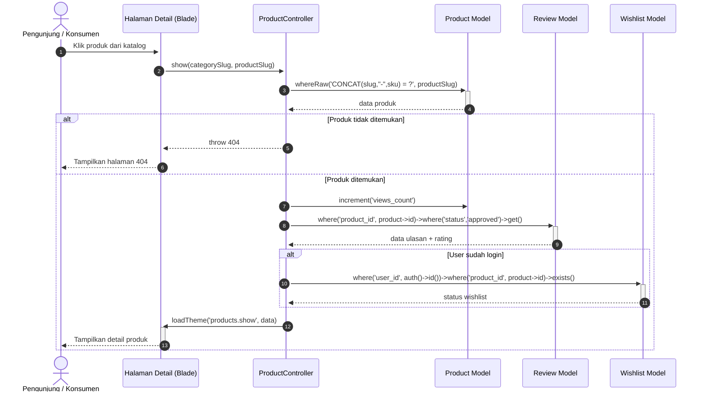
```mermaid
sequenceDiagram
    autonumber
    
    actor User as Pengunjung / Konsumen
    participant View as Halaman Detail (Blade)
    participant Ctrl as ProductController
    participant Prod as Product Model
    participant Review as Review Model
    participant Wishlist as Wishlist Model

    User->>+View: Klik produk dari katalog
    View->>+Ctrl: show(categorySlug, productSlug)
    Ctrl->>+Prod: whereRaw('CONCAT(slug,"-",sku) = ?', productSlug)
    Prod-->>-Ctrl: data produk
    
    alt Produk tidak ditemukan
        Ctrl-->>View: throw 404
        View-->>User: Tampilkan halaman 404
    else Produk ditemukan
        Ctrl->>Prod: increment('views_count')
        
        Ctrl->>+Review: where('product_id', product->id)->where('status','approved')->get()
        Review-->>-Ctrl: data ulasan + rating
        
        alt User sudah login
            Ctrl->>+Wishlist: where('user_id', auth()->id())->where('product_id', product->id)->exists()
            Wishlist-->>-Ctrl: status wishlist
        end
        
        Ctrl->>+View: loadTheme('products.show', data)
        View-->>-User: Tampilkan detail produk
    end
```

---

## 3. Register (Registrasi Konsumen)

```mermaid
sequenceDiagram
    autonumber
    
    actor Visitor as Pengunjung
    participant View as Halaman Register (Blade)
    participant Ctrl as AuthController
    participant Validator as Validasi
    participant User as User Model (DB)
    participant Mail as WelcomeCustomerMail

    Visitor->>+View: Akses halaman registrasi
    View-->>-Visitor: Tampilkan form registrasi

    Visitor->>+View: Isi data (nama, email, no_telp, password)
    View->>+Ctrl: register(request)
    Ctrl->>+Validator: validate(request)
    
    alt Validasi gagal
        Validator-->>Ctrl: error validasi
        Ctrl-->>View: redirect back with errors
        View-->>Visitor: Tampilkan pesan error
    else Validasi berhasil
        Validator-->>Ctrl: data valid
        Ctrl->>+User: create(data) - UUID primary key
        User-->>-Ctrl: user baru tersimpan
        
        Ctrl->>Mail: to(user->email)->send(WelcomeCustomerMail)
        Mail-->>-Ctrl: email terkirim
        
        Ctrl-->>View: redirect with success
        View-->>Visitor: Notifikasi registrasi berhasil
    end
```

---

## 4. Login

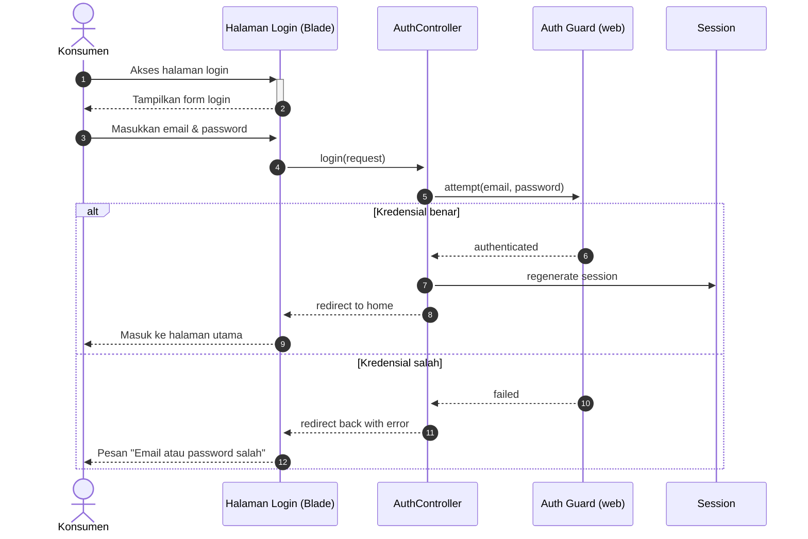
```mermaid
sequenceDiagram
    autonumber
    
    actor Customer as Konsumen
    participant View as Halaman Login (Blade)
    participant Ctrl as AuthController
    participant Auth as Auth Guard (web)
    participant Session

    Customer->>+View: Akses halaman login
    View-->>-Customer: Tampilkan form login

    Customer->>+View: Masukkan email & password
    View->>+Ctrl: login(request)
    Ctrl->>+Auth: attempt(email, password)

    alt Kredensial benar
        Auth-->>Ctrl: authenticated
        Ctrl->>Session: regenerate session
        Ctrl-->>View: redirect to home
        View-->>Customer: Masuk ke halaman utama
    else Kredensial salah
        Auth-->>Ctrl: failed
        Ctrl-->>View: redirect back with error
        View-->>Customer: Pesan "Email atau password salah"
    end
```

---

## 5. Menambahkan Wishlist

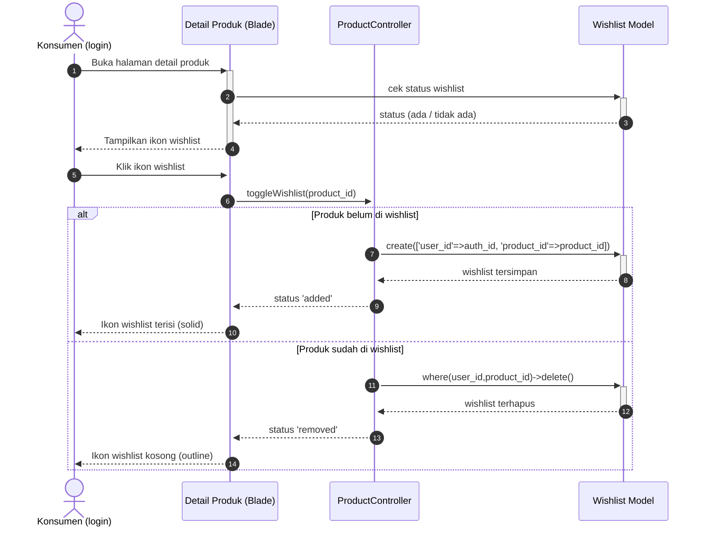
```mermaid
sequenceDiagram
    autonumber
    
    actor Customer as Konsumen (login)
    participant View as Detail Produk (Blade)
    participant Ctrl as ProductController
    participant Wishlist as Wishlist Model

    Customer->>+View: Buka halaman detail produk
    View->>+Wishlist: cek status wishlist
    Wishlist-->>-View: status (ada / tidak ada)
    View-->>-Customer: Tampilkan ikon wishlist

    Customer->>+View: Klik ikon wishlist
    View->>+Ctrl: toggleWishlist(product_id)
    
    alt Produk belum di wishlist
        Ctrl->>+Wishlist: create(['user_id'=>auth_id, 'product_id'=>product_id])
        Wishlist-->>-Ctrl: wishlist tersimpan
        Ctrl-->>View: status 'added'
        View-->>Customer: Ikon wishlist terisi (solid)
    else Produk sudah di wishlist
        Ctrl->>+Wishlist: where(user_id,product_id)->delete()
        Wishlist-->>-Ctrl: wishlist terhapus
        Ctrl-->>View: status 'removed'
        View-->>Customer: Ikon wishlist kosong (outline)
    end
```

---

## 6. Menambahkan Produk ke Keranjang Belanja

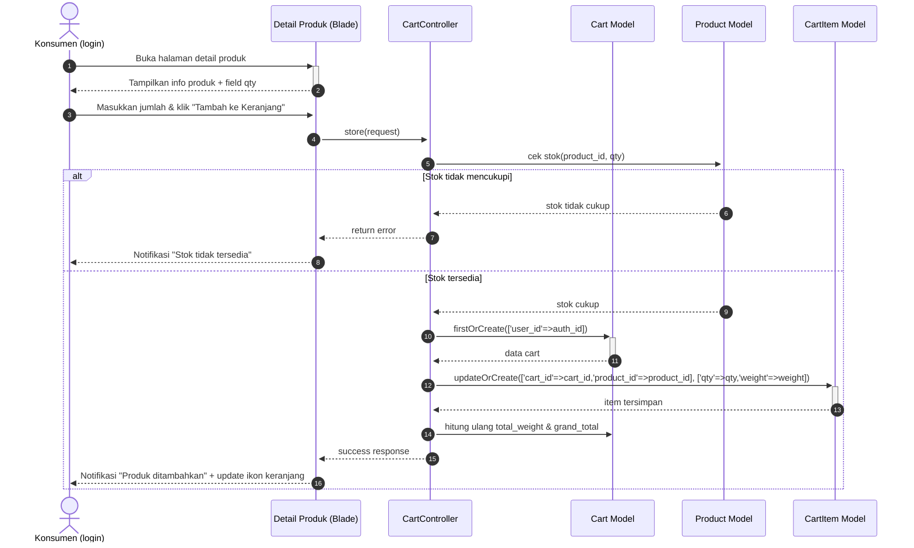
```mermaid
sequenceDiagram
    autonumber
    
    actor Customer as Konsumen (login)
    participant View as Detail Produk (Blade)
    participant Ctrl as CartController
    participant Cart as Cart Model
    participant Product as Product Model
    participant CartItem as CartItem Model

    Customer->>+View: Buka halaman detail produk
    View-->>-Customer: Tampilkan info produk + field qty

    Customer->>+View: Masukkan jumlah & klik "Tambah ke Keranjang"
    View->>+Ctrl: store(request)
    Ctrl->>+Product: cek stok(product_id, qty)
    
    alt Stok tidak mencukupi
        Product-->>Ctrl: stok tidak cukup
        Ctrl-->>View: return error
        View-->>Customer: Notifikasi "Stok tidak tersedia"
    else Stok tersedia
        Product-->>Ctrl: stok cukup
        Ctrl->>+Cart: firstOrCreate(['user_id'=>auth_id])
        Cart-->>-Ctrl: data cart
        Ctrl->>+CartItem: updateOrCreate(['cart_id'=>cart_id,'product_id'=>product_id], ['qty'=>qty,'weight'=>weight])
        CartItem-->>-Ctrl: item tersimpan
        Ctrl->>Cart: hitung ulang total_weight & grand_total
        Ctrl-->>View: success response
        View-->>Customer: Notifikasi "Produk ditambahkan" + update ikon keranjang
    end
```

---

## 7. Melakukan Transaksi (Checkout)

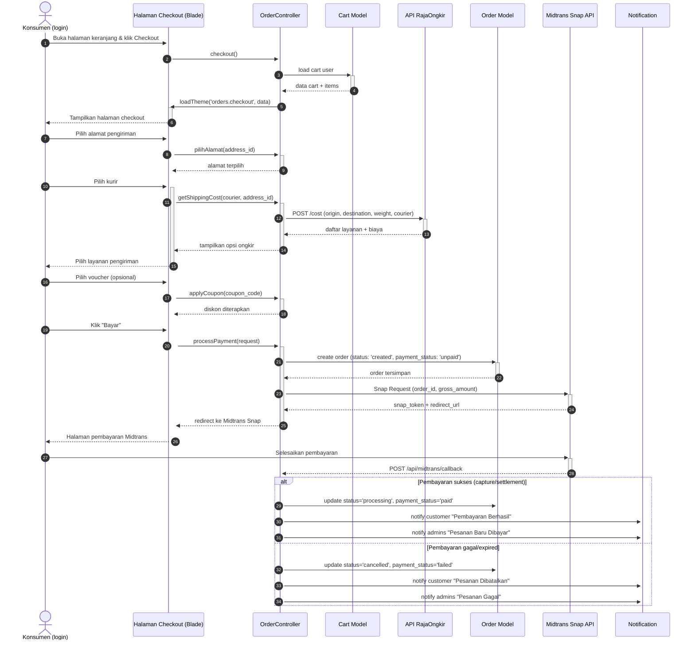
```mermaid
sequenceDiagram
    autonumber
    
    actor Customer as Konsumen (login)
    participant View as Halaman Checkout (Blade)
    participant Ctrl as OrderController
    participant Cart as Cart Model
    participant RajaOngkir as API RajaOngkir
    participant Order as Order Model
    participant Midtrans as Midtrans Snap API
    participant Notif as Notification

    Customer->>+View: Buka halaman keranjang & klik Checkout
    View->>+Ctrl: checkout()
    Ctrl->>+Cart: load cart user
    Cart-->>-Ctrl: data cart + items
    Ctrl->>+View: loadTheme('orders.checkout', data)
    View-->>-Customer: Tampilkan halaman checkout

    Customer->>+View: Pilih alamat pengiriman
    View->>+Ctrl: pilihAlamat(address_id)
    Ctrl-->>-View: alamat terpilih

    Customer->>+View: Pilih kurir
    View->>+Ctrl: getShippingCost(courier, address_id)
    Ctrl->>+RajaOngkir: POST /cost (origin, destination, weight, courier)
    RajaOngkir-->>-Ctrl: daftar layanan + biaya
    Ctrl-->>-View: tampilkan opsi ongkir
    View-->>-Customer: Pilih layanan pengiriman

    Customer->>+View: Pilih voucher (opsional)
    View->>+Ctrl: applyCoupon(coupon_code)
    Ctrl-->>-View: diskon diterapkan

    Customer->>+View: Klik "Bayar"
    View->>+Ctrl: processPayment(request)
    Ctrl->>+Order: create order (status: 'created', payment_status: 'unpaid')
    Order-->>-Ctrl: order tersimpan
    Ctrl->>+Midtrans: Snap Request (order_id, gross_amount)
    Midtrans-->>-Ctrl: snap_token + redirect_url
    Ctrl-->>-View: redirect ke Midtrans Snap
    View-->>Customer: Halaman pembayaran Midtrans

    Customer->>+Midtrans: Selesaikan pembayaran
    Midtrans-->>-Ctrl: POST /api/midtrans/callback

    alt Pembayaran sukses (capture/settlement)
        Ctrl->>+Order: update status='processing', payment_status='paid'
        Ctrl->>+Notif: notify customer "Pembayaran Berhasil"
        Ctrl->>+Notif: notify admins "Pesanan Baru Dibayar"
    else Pembayaran gagal/expired
        Ctrl->>+Order: update status='cancelled', payment_status='failed'
        Ctrl->>+Notif: notify customer "Pesanan Dibatalkan"
        Ctrl->>+Notif: notify admins "Pesanan Gagal"
    end
```

---

## 8. Klaim Voucher

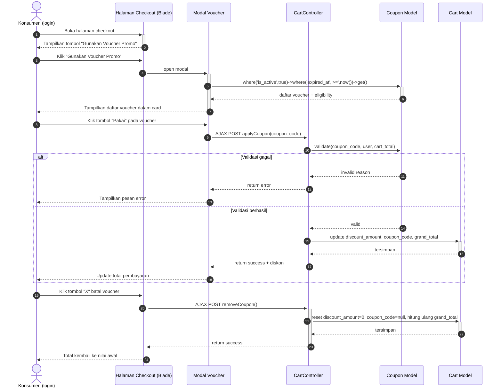
```mermaid
sequenceDiagram
    autonumber
    
    actor Customer as Konsumen (login)
    participant View as Halaman Checkout (Blade)
    participant Modal as Modal Voucher
    participant Ctrl as CartController
    participant Coupon as Coupon Model
    participant Cart as Cart Model

    Customer->>+View: Buka halaman checkout
    View-->>-Customer: Tampilkan tombol "Gunakan Voucher Promo"

    Customer->>+View: Klik "Gunakan Voucher Promo"
    View->>+Modal: open modal
    Modal->>+Coupon: where('is_active',true)->where('expired_at','>=',now())->get()
    Coupon-->>-Modal: daftar voucher + eligibility
    Modal-->>-Customer: Tampilkan daftar voucher dalam card

    Customer->>+Modal: Klik tombol "Pakai" pada voucher
    Modal->>+Ctrl: AJAX POST applyCoupon(coupon_code)
    Ctrl->>+Coupon: validate(coupon_code, user, cart_total)
    
    alt Validasi gagal
        Coupon-->>Ctrl: invalid reason
        Ctrl-->>Modal: return error
        Modal-->>Customer: Tampilkan pesan error
    else Validasi berhasil
        Coupon-->>Ctrl: valid
        Ctrl->>+Cart: update discount_amount, coupon_code, grand_total
        Cart-->>-Ctrl: tersimpan
        Ctrl-->>Modal: return success + diskon
        Modal-->>Customer: Update total pembayaran
    end

    Customer->>+View: Klik tombol "X" batal voucher
    View->>+Ctrl: AJAX POST removeCoupon()
    Ctrl->>+Cart: reset discount_amount=0, coupon_code=null, hitung ulang grand_total
    Cart-->>-Ctrl: tersimpan
    Ctrl-->>-View: return success
    View-->>Customer: Total kembali ke nilai awal
```

---

## 9. Notifikasi

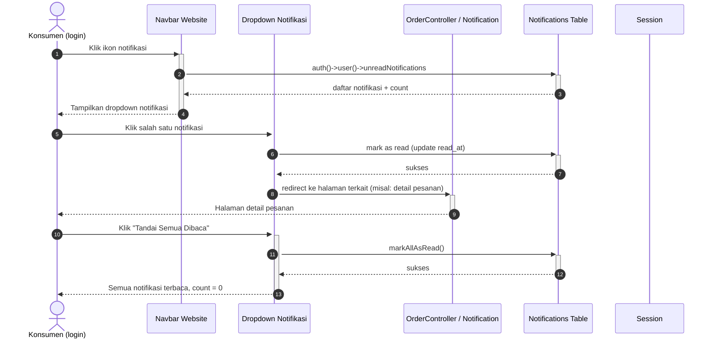
```mermaid
sequenceDiagram
    autonumber
    
    actor Customer as Konsumen (login)
    participant Navbar as Navbar Website
    participant View as Dropdown Notifikasi
    participant Ctrl as OrderController / Notification
    participant DB as Notifications Table
    participant Session

    Customer->>+Navbar: Klik ikon notifikasi
    Navbar->>+DB: auth()->user()->unreadNotifications
    DB-->>-Navbar: daftar notifikasi + count
    Navbar-->>-Customer: Tampilkan dropdown notifikasi

    Customer->>+View: Klik salah satu notifikasi
    View->>+DB: mark as read (update read_at)
    DB-->>-View: sukses
    View->>+Ctrl: redirect ke halaman terkait (misal: detail pesanan)
    Ctrl-->>-Customer: Halaman detail pesanan

    Customer->>+View: Klik "Tandai Semua Dibaca"
    View->>+DB: markAllAsRead()
    DB-->>-View: sukses
    View-->>-Customer: Semua notifikasi terbaca, count = 0
```

---

## 10. Melihat Status Pesanan

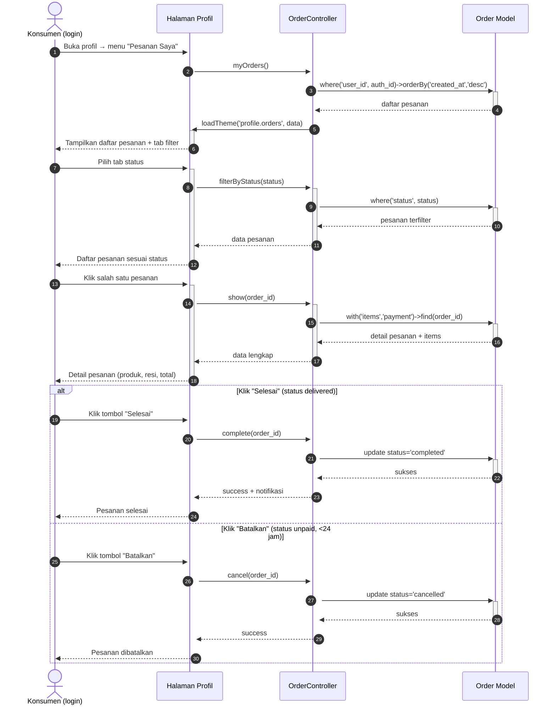
```mermaid
sequenceDiagram
    autonumber
    
    actor Customer as Konsumen (login)
    participant View as Halaman Profil
    participant OrderCtrl as OrderController
    participant Order as Order Model

    Customer->>+View: Buka profil → menu "Pesanan Saya"
    View->>+OrderCtrl: myOrders()
    OrderCtrl->>+Order: where('user_id', auth_id)->orderBy('created_at','desc')
    Order-->>-OrderCtrl: daftar pesanan
    OrderCtrl->>+View: loadTheme('profile.orders', data)
    View-->>-Customer: Tampilkan daftar pesanan + tab filter

    Customer->>+View: Pilih tab status
    View->>+OrderCtrl: filterByStatus(status)
    OrderCtrl->>+Order: where('status', status)
    Order-->>-OrderCtrl: pesanan terfilter
    OrderCtrl-->>-View: data pesanan
    View-->>-Customer: Daftar pesanan sesuai status

    Customer->>+View: Klik salah satu pesanan
    View->>+OrderCtrl: show(order_id)
    OrderCtrl->>+Order: with('items','payment')->find(order_id)
    Order-->>-OrderCtrl: detail pesanan + items
    OrderCtrl-->>-View: data lengkap
    View-->>-Customer: Detail pesanan (produk, resi, total)

    alt Klik "Selesai" (status delivered)
        Customer->>+View: Klik tombol "Selesai"
        View->>+OrderCtrl: complete(order_id)
        OrderCtrl->>+Order: update status='completed'
        Order-->>-OrderCtrl: sukses
        OrderCtrl-->>View: success + notifikasi
        View-->>Customer: Pesanan selesai
    else Klik "Batalkan" (status unpaid, <24 jam)
        Customer->>+View: Klik tombol "Batalkan"
        View->>+OrderCtrl: cancel(order_id)
        OrderCtrl->>+Order: update status='cancelled'
        Order-->>-OrderCtrl: sukses
        OrderCtrl-->>View: success
        View-->>Customer: Pesanan dibatalkan
    end
```

---

## 11. Live Chat

```mermaid
sequenceDiagram
    autonumber
    
    actor Customer as Konsumen (login)
    participant Widget as Widget Chat (Livewire)
    participant Livewire as ChatWidget Component
    participant DB as Messages Table
    participant AdminPanel as Panel Admin
    actor Admin as Admin

    Customer->>+Widget: Klik tombol chat
    Widget->>+Livewire: mount()
    Livewire->>+DB: where('conversation_id', conv_id)->get()
    DB-->>-Livewire: histori chat
    Livewire-->>-Widget: render histori
    Widget-->>-Customer: Tampilkan widget chat

    Customer->>+Widget: Ketik pesan & klik kirim
    Widget->>+Livewire: sendMessage(text)
    Livewire->>+DB: create(['conversation_id', 'sender_type'=>'customer', 'message'])
    DB-->>-Livewire: tersimpan
    Livewire-->>-Widget: tampilkan pesan baru
    Widget-->>-Customer: Pesan terkirim

    Admin->>+AdminPanel: Buka menu Chat
    AdminPanel->>+DB: where('sender_type','customer')->orWhere('sender_type','admin')->get()
    DB-->>-AdminPanel: percakapan
    AdminPanel-->>-Admin: Lihat pesan customer

    Admin->>+AdminPanel: Ketik balasan & kirim
    AdminPanel->>+DB: create(['sender_type'=>'admin', 'message'])
    DB-->>-AdminPanel: tersimpan
    AdminPanel-->>-Admin: balasan terkirim
    DB-->>-Livewire: dispatch event pesan baru
    Livewire-->>-Widget: update pesan
    Widget-->>-Customer: Tampilkan balasan admin
```

---

## 12. Profil

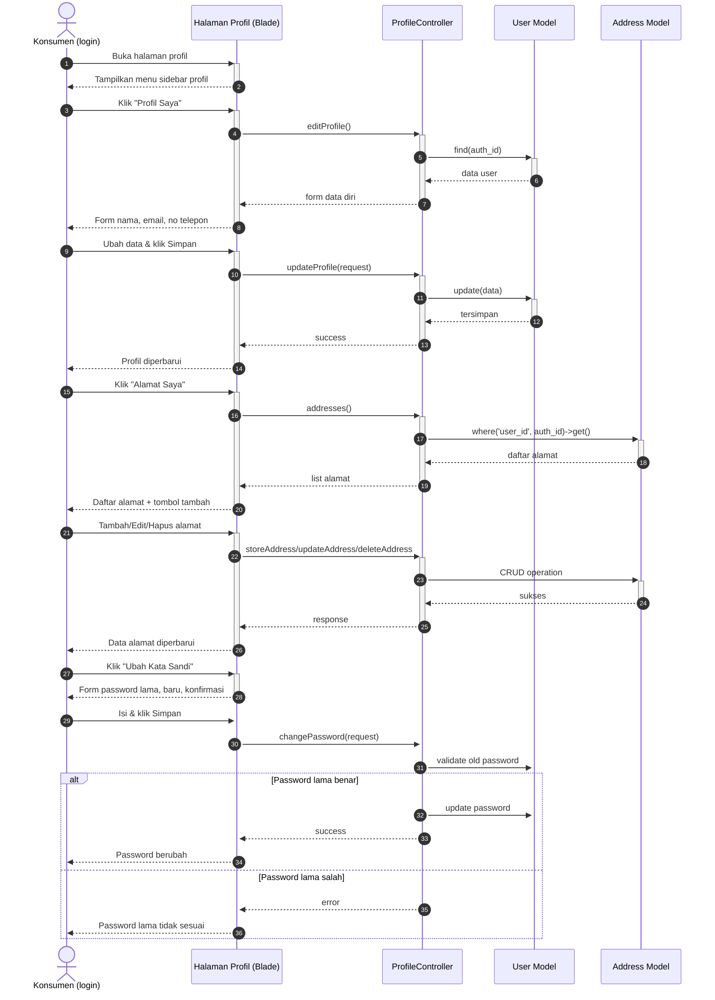
```mermaid
sequenceDiagram
    autonumber
    
    actor Customer as Konsumen (login)
    participant View as Halaman Profil (Blade)
    participant Ctrl as ProfileController
    participant User as User Model
    participant Address as Address Model

    Customer->>+View: Buka halaman profil
    View-->>-Customer: Tampilkan menu sidebar profil

    %% Sub-alur: Edit Profil
    Customer->>+View: Klik "Profil Saya"
    View->>+Ctrl: editProfile()
    Ctrl->>+User: find(auth_id)
    User-->>-Ctrl: data user
    Ctrl-->>-View: form data diri
    View-->>-Customer: Form nama, email, no telepon
    Customer->>+View: Ubah data & klik Simpan
    View->>+Ctrl: updateProfile(request)
    Ctrl->>+User: update(data)
    User-->>-Ctrl: tersimpan
    Ctrl-->>-View: success
    View-->>-Customer: Profil diperbarui

    %% Sub-alur: Kelola Alamat
    Customer->>+View: Klik "Alamat Saya"
    View->>+Ctrl: addresses()
    Ctrl->>+Address: where('user_id', auth_id)->get()
    Address-->>-Ctrl: daftar alamat
    Ctrl-->>-View: list alamat
    View-->>-Customer: Daftar alamat + tombol tambah
    Customer->>+View: Tambah/Edit/Hapus alamat
    View->>+Ctrl: storeAddress/updateAddress/deleteAddress
    Ctrl->>+Address: CRUD operation
    Address-->>-Ctrl: sukses
    Ctrl-->>-View: response
    View-->>-Customer: Data alamat diperbarui

    %% Sub-alur: Ubah Password
    Customer->>+View: Klik "Ubah Kata Sandi"
    View-->>-Customer: Form password lama, baru, konfirmasi
    Customer->>+View: Isi & klik Simpan
    View->>+Ctrl: changePassword(request)
    Ctrl->>+User: validate old password
    alt Password lama benar
        Ctrl->>+User: update password
        Ctrl-->>View: success
        View-->>Customer: Password berubah
    else Password lama salah
        Ctrl-->>View: error
        View-->>Customer: Password lama tidak sesuai
    end
```

---

## 13. Review Produk

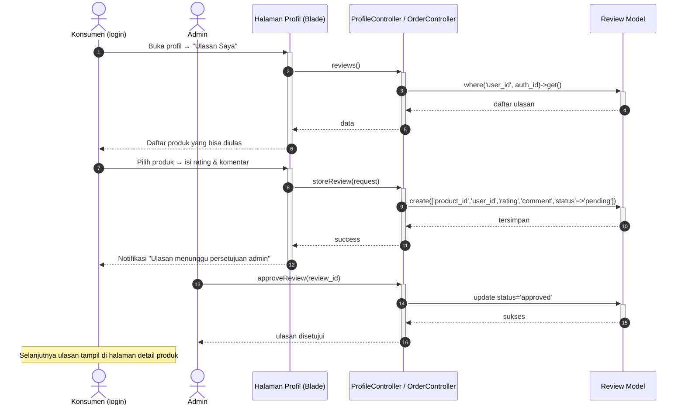
```mermaid
sequenceDiagram
    autonumber
    
    actor Customer as Konsumen (login)
    actor Admin as Admin
    participant View as Halaman Profil (Blade)
    participant Ctrl as ProfileController / OrderController
    participant Review as Review Model

    Customer->>+View: Buka profil → "Ulasan Saya"
    View->>+Ctrl: reviews()
    Ctrl->>+Review: where('user_id', auth_id)->get()
    Review-->>-Ctrl: daftar ulasan
    Ctrl-->>-View: data
    View-->>-Customer: Daftar produk yang bisa diulas

    Customer->>+View: Pilih produk → isi rating & komentar
    View->>+Ctrl: storeReview(request)
    Ctrl->>+Review: create(['product_id','user_id','rating','comment','status'=>'pending'])
    Review-->>-Ctrl: tersimpan
    Ctrl-->>-View: success
    View-->>-Customer: Notifikasi "Ulasan menunggu persetujuan admin"

    Admin->>+Ctrl: approveReview(review_id)
    Ctrl->>+Review: update status='approved'
    Review-->>-Ctrl: sukses
    Ctrl-->>-Admin: ulasan disetujui
    Note over Customer: Selanjutnya ulasan tampil di halaman detail produk
```

---

## 14. Logout

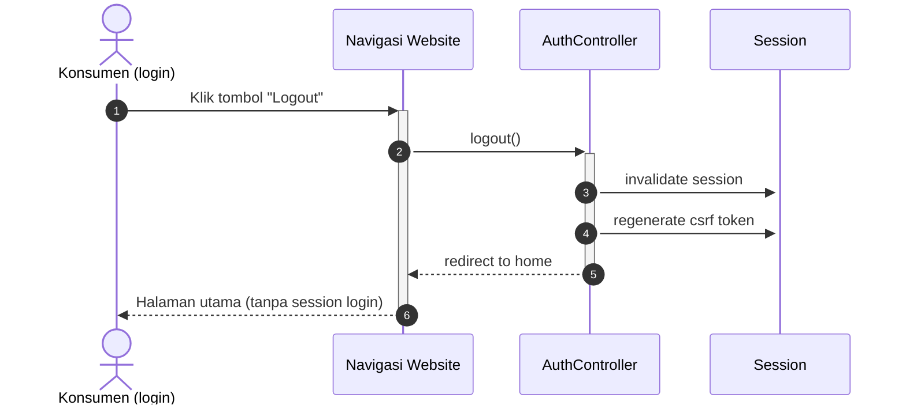
```mermaid
sequenceDiagram
    autonumber
    
    actor Customer as Konsumen (login)
    participant View as Navigasi Website
    participant Ctrl as AuthController
    participant Session

    Customer->>+View: Klik tombol "Logout"
    View->>+Ctrl: logout()
    Ctrl->>+Session: invalidate session
    Ctrl->>Session: regenerate csrf token
    Ctrl-->>-View: redirect to home
    View-->>-Customer: Halaman utama (tanpa session login)
```

---

## 15. Login Admin

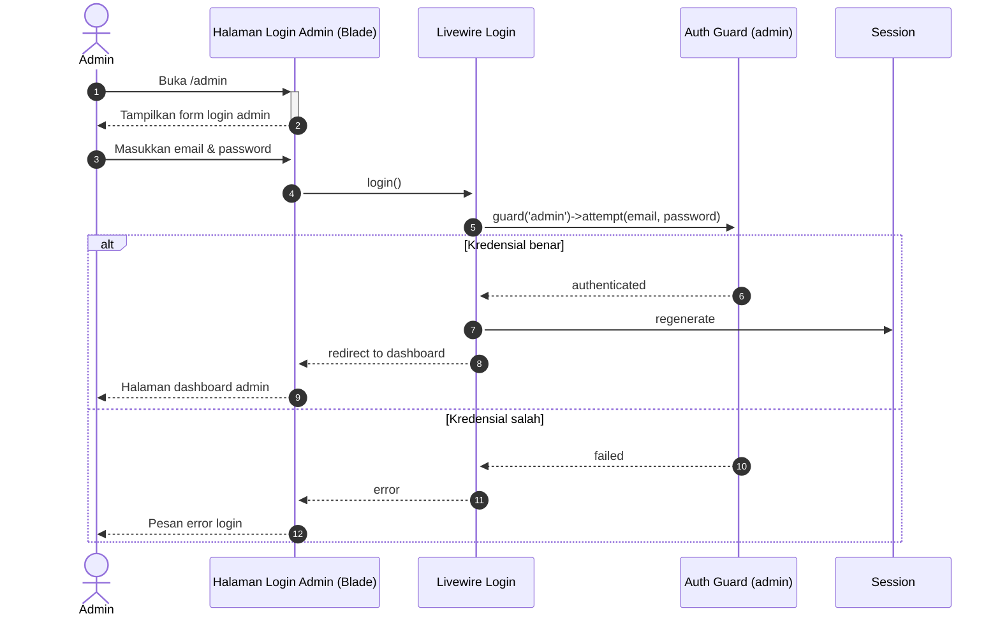
```mermaid
sequenceDiagram
    autonumber
    
    actor Admin as Admin
    participant View as Halaman Login Admin (Blade)
    participant Ctrl as Livewire Login
    participant Auth as Auth Guard (admin)
    participant Session

    Admin->>+View: Buka /admin
    View-->>-Admin: Tampilkan form login admin

    Admin->>+View: Masukkan email & password
    View->>+Ctrl: login()
    Ctrl->>+Auth: guard('admin')->attempt(email, password)

    alt Kredensial benar
        Auth-->>Ctrl: authenticated
        Ctrl->>Session: regenerate
        Ctrl-->>View: redirect to dashboard
        View-->>Admin: Halaman dashboard admin
    else Kredensial salah
        Auth-->>Ctrl: failed
        Ctrl-->>View: error
        View-->>Admin: Pesan error login
    end
```

---

## 16. Kelola Kategori Produk

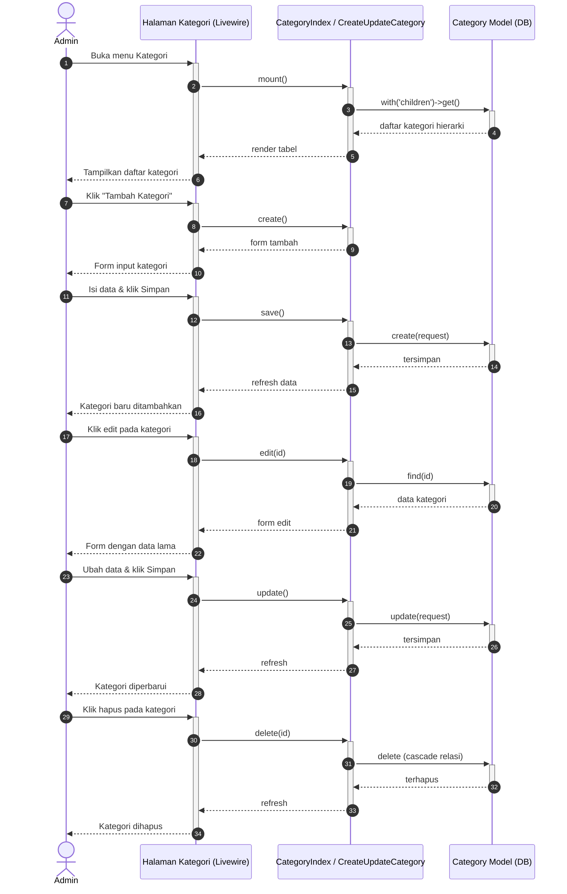
```mermaid
sequenceDiagram
    autonumber
    
    actor Admin as Admin
    participant View as Halaman Kategori (Livewire)
    participant Livewire as CategoryIndex / CreateUpdateCategory
    participant Model as Category Model (DB)

    Admin->>+View: Buka menu Kategori
    View->>+Livewire: mount()
    Livewire->>+Model: with('children')->get()
    Model-->>-Livewire: daftar kategori hierarki
    Livewire-->>-View: render tabel
    View-->>-Admin: Tampilkan daftar kategori

    %% Tambah Kategori
    Admin->>+View: Klik "Tambah Kategori"
    View->>+Livewire: create()
    Livewire-->>-View: form tambah
    View-->>-Admin: Form input kategori
    Admin->>+View: Isi data & klik Simpan
    View->>+Livewire: save()
    Livewire->>+Model: create(request)
    Model-->>-Livewire: tersimpan
    Livewire-->>-View: refresh data
    View-->>-Admin: Kategori baru ditambahkan

    %% Edit Kategori
    Admin->>+View: Klik edit pada kategori
    View->>+Livewire: edit(id)
    Livewire->>+Model: find(id)
    Model-->>-Livewire: data kategori
    Livewire-->>-View: form edit
    View-->>-Admin: Form dengan data lama
    Admin->>+View: Ubah data & klik Simpan
    View->>+Livewire: update()
    Livewire->>+Model: update(request)
    Model-->>-Livewire: tersimpan
    Livewire-->>-View: refresh
    View-->>-Admin: Kategori diperbarui

    %% Hapus Kategori
    Admin->>+View: Klik hapus pada kategori
    View->>+Livewire: delete(id)
    Livewire->>+Model: delete (cascade relasi)
    Model-->>-Livewire: terhapus
    Livewire-->>-View: refresh
    View-->>-Admin: Kategori dihapus
```

---

## 17. Kelola Produk

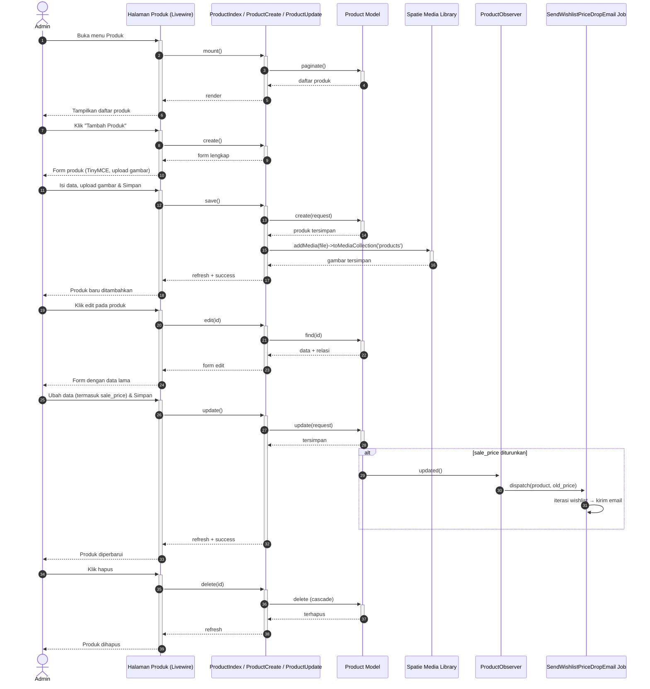
```mermaid
sequenceDiagram
    autonumber
    
    actor Admin as Admin
    participant View as Halaman Produk (Livewire)
    participant Livewire as ProductIndex / ProductCreate / ProductUpdate
    participant Prod as Product Model
    participant Media as Spatie Media Library
    participant Observer as ProductObserver
    participant Job as SendWishlistPriceDropEmail Job

    Admin->>+View: Buka menu Produk
    View->>+Livewire: mount()
    Livewire->>+Prod: paginate()
    Prod-->>-Livewire: daftar produk
    Livewire-->>-View: render
    View-->>-Admin: Tampilkan daftar produk

    %% Tambah Produk
    Admin->>+View: Klik "Tambah Produk"
    View->>+Livewire: create()
    Livewire-->>-View: form lengkap
    View-->>-Admin: Form produk (TinyMCE, upload gambar)
    Admin->>+View: Isi data, upload gambar & Simpan
    View->>+Livewire: save()
    Livewire->>+Prod: create(request)
    Prod-->>-Livewire: produk tersimpan
    Livewire->>+Media: addMedia(file)->toMediaCollection('products')
    Media-->>-Livewire: gambar tersimpan
    Livewire-->>-View: refresh + success
    View-->>-Admin: Produk baru ditambahkan

    %% Edit Produk
    Admin->>+View: Klik edit pada produk
    View->>+Livewire: edit(id)
    Livewire->>+Prod: find(id)
    Prod-->>-Livewire: data + relasi
    Livewire-->>-View: form edit
    View-->>-Admin: Form dengan data lama
    Admin->>+View: Ubah data (termasuk sale_price) & Simpan
    View->>+Livewire: update()
    Livewire->>+Prod: update(request)
    Prod-->>-Livewire: tersimpan

    alt sale_price diturunkan
        Prod->>+Observer: updated()
        Observer->>+Job: dispatch(product, old_price)
        Job->>Job: iterasi wishlist → kirim email
    end

    Livewire-->>-View: refresh + success
    View-->>-Admin: Produk diperbarui

    %% Hapus Produk
    Admin->>+View: Klik hapus
    View->>+Livewire: delete(id)
    Livewire->>+Prod: delete (cascade)
    Prod-->>-Livewire: terhapus
    Livewire-->>-View: refresh
    View-->>-Admin: Produk dihapus
```

---

## 18. Kelola Voucher Belanja

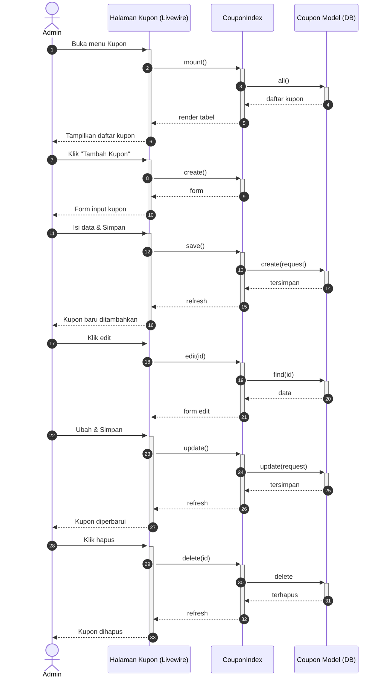
```mermaid
sequenceDiagram
    autonumber
    
    actor Admin as Admin
    participant View as Halaman Kupon (Livewire)
    participant Livewire as CouponIndex
    participant Model as Coupon Model (DB)

    Admin->>+View: Buka menu Kupon
    View->>+Livewire: mount()
    Livewire->>+Model: all()
    Model-->>-Livewire: daftar kupon
    Livewire-->>-View: render tabel
    View-->>-Admin: Tampilkan daftar kupon

    %% Tambah Kupon
    Admin->>+View: Klik "Tambah Kupon"
    View->>+Livewire: create()
    Livewire-->>-View: form
    View-->>-Admin: Form input kupon
    Admin->>+View: Isi data & Simpan
    View->>+Livewire: save()
    Livewire->>+Model: create(request)
    Model-->>-Livewire: tersimpan
    Livewire-->>-View: refresh
    View-->>-Admin: Kupon baru ditambahkan

    %% Edit Kupon
    Admin->>+View: Klik edit
    View->>+Livewire: edit(id)
    Livewire->>+Model: find(id)
    Model-->>-Livewire: data
    Livewire-->>-View: form edit
    Admin->>+View: Ubah & Simpan
    View->>+Livewire: update()
    Livewire->>+Model: update(request)
    Model-->>-Livewire: tersimpan
    Livewire-->>-View: refresh
    View-->>-Admin: Kupon diperbarui

    %% Hapus Kupon
    Admin->>+View: Klik hapus
    View->>+Livewire: delete(id)
    Livewire->>+Model: delete
    Model-->>-Livewire: terhapus
    Livewire-->>-View: refresh
    View-->>-Admin: Kupon dihapus
```

---

## 19. Kelola Pesanan

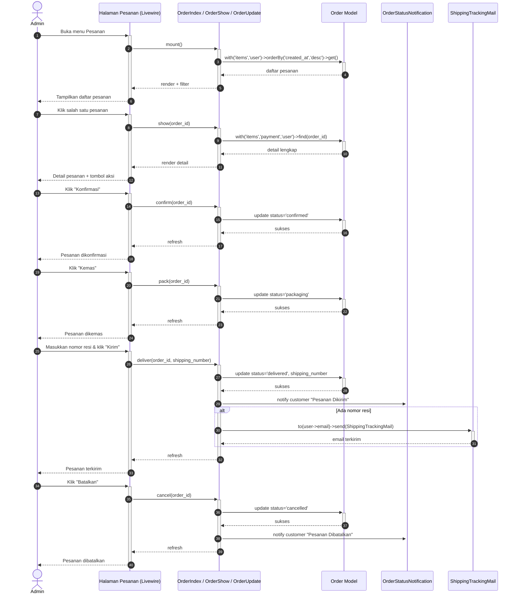
```mermaid
sequenceDiagram
    autonumber
    
    actor Admin as Admin
    participant View as Halaman Pesanan (Livewire)
    participant Livewire as OrderIndex / OrderShow / OrderUpdate
    participant Order as Order Model
    participant Notif as OrderStatusNotification
    participant Mail as ShippingTrackingMail

    Admin->>+View: Buka menu Pesanan
    View->>+Livewire: mount()
    Livewire->>+Order: with('items','user')->orderBy('created_at','desc')->get()
    Order-->>-Livewire: daftar pesanan
    Livewire-->>-View: render + filter
    View-->>-Admin: Tampilkan daftar pesanan

    Admin->>+View: Klik salah satu pesanan
    View->>+Livewire: show(order_id)
    Livewire->>+Order: with('items','payment','user')->find(order_id)
    Order-->>-Livewire: detail lengkap
    Livewire-->>-View: render detail
    View-->>-Admin: Detail pesanan + tombol aksi

    %% Konfirmasi
    Admin->>+View: Klik "Konfirmasi"
    View->>+Livewire: confirm(order_id)
    Livewire->>+Order: update status='confirmed'
    Order-->>-Livewire: sukses
    Livewire-->>-View: refresh
    View-->>-Admin: Pesanan dikonfirmasi

    %% Kemas
    Admin->>+View: Klik "Kemas"
    View->>+Livewire: pack(order_id)
    Livewire->>+Order: update status='packaging'
    Order-->>-Livewire: sukses
    Livewire-->>-View: refresh
    View-->>-Admin: Pesanan dikemas

    %% Kirim
    Admin->>+View: Masukkan nomor resi & klik "Kirim"
    View->>+Livewire: deliver(order_id, shipping_number)
    Livewire->>+Order: update status='delivered', shipping_number
    Order-->>-Livewire: sukses
    Livewire->>+Notif: notify customer "Pesanan Dikirim"
    
    alt Ada nomor resi
        Livewire->>+Mail: to(user->email)->send(ShippingTrackingMail)
        Mail-->>-Livewire: email terkirim
    end
    
    Livewire-->>-View: refresh
    View-->>-Admin: Pesanan terkirim

    %% Batalkan
    Admin->>+View: Klik "Batalkan"
    View->>+Livewire: cancel(order_id)
    Livewire->>+Order: update status='cancelled'
    Order-->>-Livewire: sukses
    Livewire->>+Notif: notify customer "Pesanan Dibatalkan"
    Livewire-->>-View: refresh
    View-->>-Admin: Pesanan dibatalkan
```

---

## 20. Melihat Data Konsumen

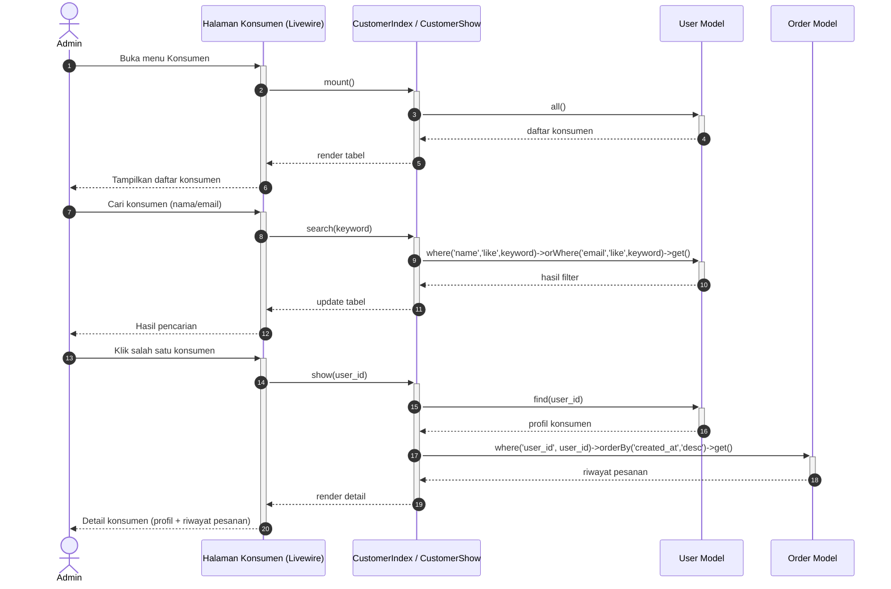
```mermaid
sequenceDiagram
    autonumber
    
    actor Admin as Admin
    participant View as Halaman Konsumen (Livewire)
    participant Livewire as CustomerIndex / CustomerShow
    participant User as User Model
    participant Order as Order Model

    Admin->>+View: Buka menu Konsumen
    View->>+Livewire: mount()
    Livewire->>+User: all()
    User-->>-Livewire: daftar konsumen
    Livewire-->>-View: render tabel
    View-->>-Admin: Tampilkan daftar konsumen

    Admin->>+View: Cari konsumen (nama/email)
    View->>+Livewire: search(keyword)
    Livewire->>+User: where('name','like',keyword)->orWhere('email','like',keyword)->get()
    User-->>-Livewire: hasil filter
    Livewire-->>-View: update tabel
    View-->>-Admin: Hasil pencarian

    Admin->>+View: Klik salah satu konsumen
    View->>+Livewire: show(user_id)
    Livewire->>+User: find(user_id)
    User-->>-Livewire: profil konsumen
    Livewire->>+Order: where('user_id', user_id)->orderBy('created_at','desc')->get()
    Order-->>-Livewire: riwayat pesanan
    Livewire-->>-View: render detail
    View-->>-Admin: Detail konsumen (profil + riwayat pesanan)
```

---

## 21. Laporan Penjualan

```mermaid
sequenceDiagram
    autonumber
    
    actor Admin as Admin
    participant View as Halaman Laporan (Livewire)
    participant Livewire as ReportIndex
    participant Order as Order Model
    participant Chart as ApexCharts (JS)

    Admin->>+View: Buka menu Laporan
    View->>+Livewire: mount()
    Livewire->>+Order: selectRaw('DATE(created_at) as date, COUNT(*) as total, SUM(grand_total) as revenue')->where('status','completed')->groupBy('date')->orderBy('date','desc')->limit(30)->get()
    Order-->>-Livewire: data penjualan 30 hari
    Livewire-->>-View: kirim data ke JS
    View->>+Chart: render grafik
    Chart-->>-View: Grafik penjualan
    View-->>-Admin: Grafik + ringkasan (total pesanan, revenue, produk terlaris)

    Admin->>+View: Filter rentang tanggal
    View->>+Livewire: filterDateRange(start, end)
    Livewire->>+Order: whereBetween('created_at', [start, end])->get()
    Order-->>-Livewire: data terfilter
    Livewire-->>-View: update data
    View->>+Chart: update grafik
    Chart-->>-View: Grafik diperbarui
    View-->>-Admin: Laporan sesuai periode
```

---

## 22. Kelola Konten Homepage

```mermaid
sequenceDiagram
    autonumber
    
    actor Admin as Admin
    participant View as Halaman Pengaturan (Livewire)
    participant Livewire as SettingIndex
    participant Setting as Setting Model
    participant SettingImg as SettingImage Model
    participant Cache as Cache System

    Admin->>+View: Buka menu Pengaturan
    View->>+Livewire: mount()
    Livewire->>+Setting: getValue() untuk setiap key
    Setting->>+Cache: rememberForever('setting_'.key)
    
    alt Cache tersedia
        Cache-->>Setting: nilai dari cache
    else Cache tidak tersedia
        Setting->>Setting: query database
        Setting-->>Cache: simpan ke cache
    end
    
    Setting-->>-Livewire: nilai settings
    Livewire-->>-View: render 5 form section
    View-->>-Admin: Form Identitas, Hero, Promo, About, Galeri

    %% Update teks
    Admin->>+View: Ubah field teks (judul, subjudul, dll)
    Admin->>+View: Klik "Simpan" pada bagian
    View->>+Livewire: saveHero() / savePromo() / saveAbout()
    Livewire->>+Setting: setValue(key, value, type)
    Setting->>Setting: updateOrCreate(['key'=>key], ['value'=>value, 'type'=>type])
    Setting->>+Cache: forget('setting_'.key)
    Cache-->>-Setting: cache terhapus
    Setting-->>-Livewire: tersimpan
    Livewire-->>-View: flash success
    View-->>-Admin: Notifikasi sukses

    %% Update gambar
    Admin->>+View: Upload file gambar baru
    Admin->>+View: Klik "Simpan"
    View->>+Livewire: saveHero() (dengan file)
    Livewire->>Livewire: store('settings', 'public')
    Livewire->>+Setting: setValue(key, 'storage/settings/...', 'image')
    Setting->>Setting: updateOrCreate + cache forget
    Setting-->>-Livewire: tersimpan
    Livewire->>+SettingImg: create(['setting_key'=>key, 'image_path'=>path])
    SettingImg-->>-Livewire: history tercatat
    Livewire-->>-View: flash success
    View-->>-Admin: Gambar diperbarui

    %% Pilih dari history
    Admin->>+View: Pilih gambar dari history slider
    View->>+Livewire: selectFromHistory(key, path)
    Livewire->>+Setting: setValue(key, path, 'image')
    Setting-->>-Livewire: tersimpan
    Livewire-->>-View: refresh
    View-->>-Admin: Gambar dari history aktif

    %% Upload galeri
    Admin->>+View: Upload gambar ke galeri
    View->>+Livewire: uploadGalleryImage()
    Livewire->>+SettingImg: create(['setting_key'=>'about_gallery', 'image_path'=>path])
    SettingImg-->>-Livewire: tersimpan
    Livewire-->>-View: update galeri
    View-->>-Admin: Galeri bertambah
```
